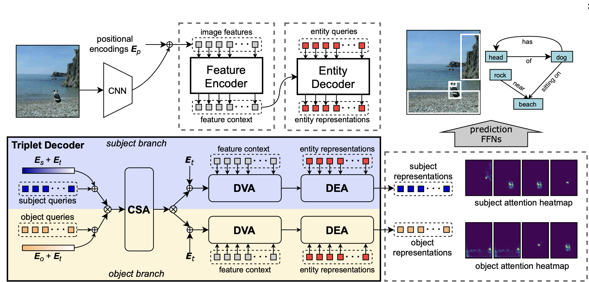
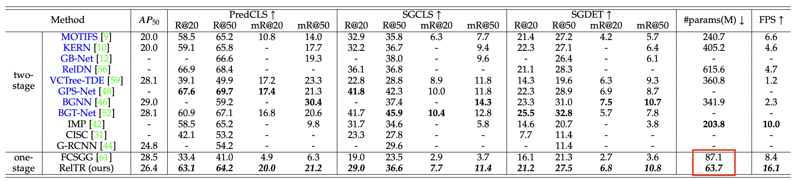

  <h1 align="center">RelTR - Intro to ML Project</h1>
  
  

  

## Overview

In this project, we summarize the paper RelTR: Relational Transformer for scene graph generation and validate a claim made by the authors.

     
  <h5 align="center">
    Overall architecture of RelTR[1]
  </h5>

## Claim Validation
The authors claim RelTR[] has lower number of parameters compared to other scene graph generation models such as FCSGG[].

     
  <h5 align="center">
    Performance and parameter comparison of RelTR with other models[]
  </h5>

FCSGG[] has multiple configurations with varying backbone architectures. Since the authors of RelTR do not specify which configuration is used and RelTR uses the ResNet50 as a backbone, we decided it would only be fair to test when both architectures use the same backbone.

### Authors
- [Shubham Gupta](https://github.com/IamShubhamGupto)
- [Karan Sharma](https://github.com/ks47)
